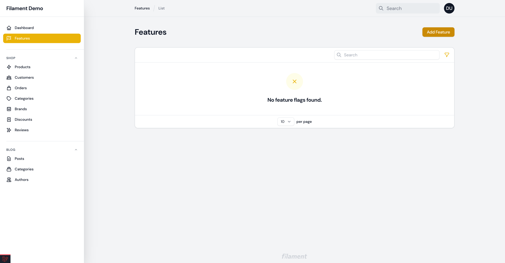
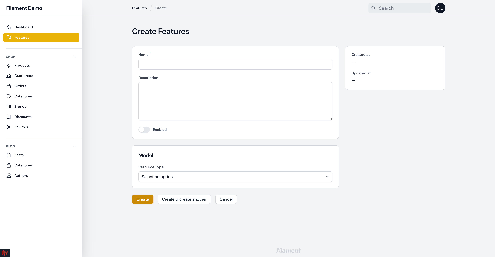
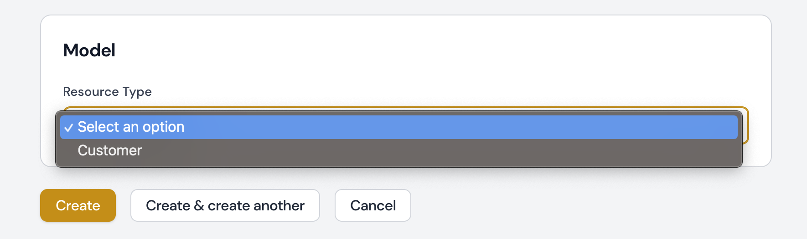
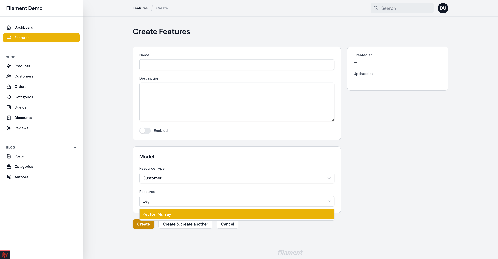
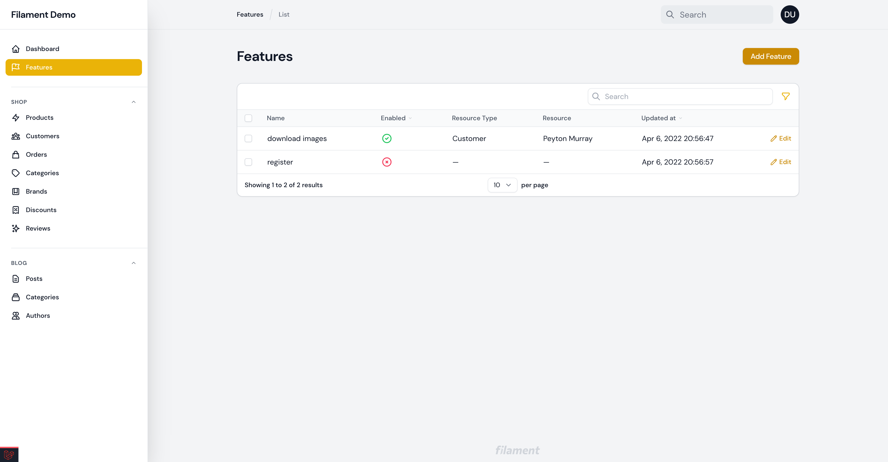

# Control your Laravel feature flags through a clean Filament interface.

[](https://packagist.org/packages/ryangjchandler/filament-feature-flags)
[](https://github.com/ryangjchandler/filament-feature-flags/actions?query=workflow%3Arun-tests+branch%3Amain)
[](https://github.com/ryangjchandler/filament-feature-flags/actions?query=workflow%3A"Check+%26+fix+styling"+branch%3Amain)
[](https://packagist.org/packages/ryangjchandler/filament-feature-flags)

This packages provide a graphical wrapper around [ryangjchandler/laravel-feature-flags](https://github.com/ryangjchandler/laravel-feature-flags).

## Installation

You can install the package via Composer:

```bash
composer require ryangjchandler/filament-feature-flags
```

You should also follow the [installation instructions for underlying package](https://github.com/ryangjchandler/laravel-feature-flags#installation);

## Usage

Once installed, this package will register a new "Features" resource.



### Adding a new flag

To add a new flag, click the "Add Feature" button and you'll be presented with a form.



The _only_ required field in the form is the "Name" field. The "Description" field is optional and only serves as metadata for users.

You can toggle the value of flag by switching the toggle input labelled "Enabled".

#### Scoping a flag to a resource / model

> You should follow the [documentation on setting up models for feature flags](https://github.com/ryangjchandler/laravel-feature-flags#model-flags) before continuing.

Being by implementing the `RyanChandler\FilamentFeatureFlags\Contracts\FlaggableResource` interface on your chosen `Resource` class.

```php
use RyanChandler\FilamentFeatureFlags\Contracts\FlaggableResource;

class CustomerResource extends Resource implements FlaggableResource
{
    public static function getFlaggableRecordDisplayColumn(): string
    {
        return 'name';
    }
}
```

The `getFlaggableRecordDisplayColumn()` method should return the name of the column you'd like to display when searching for your flaggable records.

Now that you've implemented the `FlaggableResource` interface, you should be able to see your resource show up as an option in the "Resource Type" field.



If you select the resource, you'll see a new "Resource" field appear underneath. This field is a searchable `Select` field and can be used to search for and choose the record this flag is associated with.



Once you've selected a record, save the feature flag and it will be associated with it.

### Table

The table will show all flags, including flags associated with models / resources.



## Testing

```bash
composer test
```

## Changelog

Please see [CHANGELOG](CHANGELOG.md) for more information on what has changed recently.

## Contributing

Please see [CONTRIBUTING](.github/CONTRIBUTING.md) for details.

## Security Vulnerabilities

Please review [our security policy](../../security/policy) on how to report security vulnerabilities.

## Credits

- [Ryan Chandler](https://github.com/ryangjchandler)
- [All Contributors](../../contributors)

## License

The MIT License (MIT). Please see [License File](LICENSE.md) for more information.
